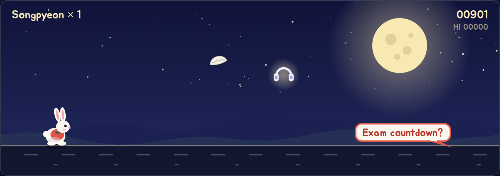
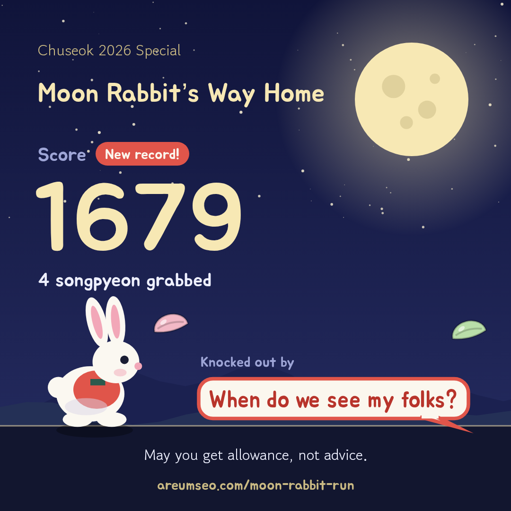

# Moon Rabbit’s Way Home (달토끼 귀성길)

A tiny Chuseok runner game in the spirit of the Chrome dino. Help the moon rabbit get home for the holiday by jumping over the nagging relatives always bring up, like “Married yet?” or “How much do you make?”, and grab songpyeon along the way.

**▶ Play: https://areumseo.com/moon-rabbit-run/**

Chuseok is Korea’s harvest holiday. Think Thanksgiving, with rice cakes and relatives asking way too many questions.

## How to play

- **Jump**: press `Space` or `↑`, or tap the screen
- **Jump higher**: hold the key or keep your finger down
- **Songpyeon**: +10 points each
- 🧧 **Cash envelope**: invincible for a few seconds, and nagging just bounces off
- 🎧 **Headphones**: mutes every nag on screen

The game speeds up as you go. When you’re knocked out, you can save a score card image or copy a one-line result to share.

  
  

## Features

- Korean and English, with a KO/EN toggle (defaults to your browser language)
- Works on desktop and mobile
- Shareable 1080×1080 score card: phones open the share sheet, desktops download a PNG
- Best score is saved in your browser
- Link preview image for LinkedIn, KakaoTalk and the like
- Privacy-friendly visit and event counts with GoatCounter (no cookies)
- One HTML file with no build step and no dependencies (just Google Fonts)

## How it was built

I built this in about a day with an AI pair programmer:

- **Code**: written with Claude Code, from the first idea to deployment
- **English copy**: reviewed with GPT-6 Astra so the nagging lines sound natural, not translated
- **Hosting**: GitHub Pages on my own domain

Everything in the game is drawn in code with the Canvas 2D API, so the game itself uses no image files. The images in `assets/` are only for this README and the link preview.

### Problems I ran into

- **Phones showed the desktop layout.** GitHub Pages serves the file exactly as written, and the page had no viewport meta tag. Adding it fixed the layout.
- **The game-over panel didn’t fit on phones.** On a narrow screen the canvas is only about 120px tall, so the title and buttons were cut off. On small screens the panel now opens below the canvas.
- **Keeping the share sheet happy.** Browsers only open the share sheet right after a tap, so drawing the card on tap risked missing that window. The card is drawn as soon as the run ends, so it’s ready the moment you tap.
- **Early game starts weren’t counted.** The analytics script loads last so it never slows the page down, and a quick tap on Start could come before it was ready. Events are now held until the script loads.
- **Switching languages mid-run.** The Korean and English nag lists share the same order, so switching language swaps the text on screen without restarting the run.

## Run locally

Open `index.html` in a browser. That’s it.

Made for Chuseok 2026. 풍성한 한가위 보내세요!
